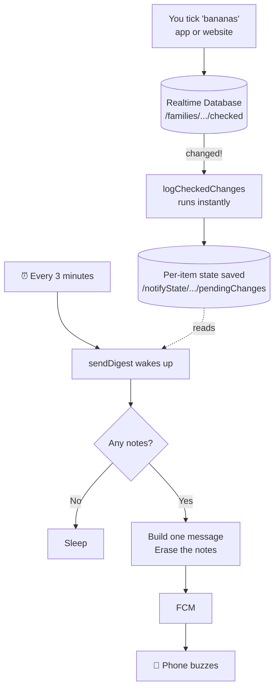

# How the Grocery List App Works — A Beginner's Guide

Written for someone who hasn't done backend work before. No prior
knowledge assumed. If a term shows up in **bold**, it's explained in the
[Glossary](#glossary) at the bottom.

---

## The one-paragraph version

You had a web page that stores the family shopping list in a shared
online database. We wrapped that page in an Android app so it has an
icon on your phone, and we added two small programs that run on Google's
computers: one notices whenever somebody ticks an item, and another
wakes up every 3 minutes and — if anything was ticked — sends one push
notification summarizing it. Nothing runs on a computer you own.

---

## Part 1 — What you had before

Three pieces:

**1. An HTML file.** One file containing the whole app: the layout, the
styling, and the JavaScript logic. Open it in a browser and it works.

**2. Netlify.** A **hosting** service. Its only job is: somebody visits
your URL, Netlify hands them that HTML file. Think of it as a
photocopier — it gives out copies of the page, it doesn't *do* anything.

**3. Firebase Realtime Database.** A database that lives on Google's
computers and is reachable over the internet. Think of it as a shared
notebook: your phone writes a line, and my phone can read that line a
second later.

Here's the important bit, and it surprises most people:

> **There was no backend.** The web page talked *directly* to the
> database from your browser. No server of yours sat in between.

Normally an app goes `browser → your server → database`. This one goes
`browser → database`. Firebase is built to allow that. It's why the
whole thing was one HTML file with no build step — genuinely simple, and
that simplicity is a feature.

### What the database actually holds

At the path `/families/my_family_shopping_list_2024` there's an object
like:

```json
{
  "checked": {
    "🥦 ירקות ופירות||בננות": true,
    "🧀 מוצרי חלב||קוטג'": false
  },
  "customItems": { },
  "lastPurchaseTime": 1757090000000
}
```

`checked` is the interesting one: a big list of `item → ticked or not`.
Every tick or untick rewrites this.

---

## Part 2 — Why notifications needed something new

Here's the problem. Your phone can only be told "something changed" if
**something is awake to tell it**.

The web page only runs while it's open on screen. Close the tab, and it's
gone — it can't notice anything or send anything. So when your partner
ticks "milk" at the supermarket, there's nothing running anywhere whose
job it is to go "hey, tell everyone else."

That gap — *something that's always available, even when nobody has the
app open* — is exactly what a backend is for.

The old-school answer: rent a computer (a **server**), keep it running
24/7, install your code on it, maintain it, patch it, pay for it every
month even at 3am when nothing is happening.

That's a lot of machinery for "send a text message occasionally."

---

## Part 3 — What a Cloud Function is

A **Cloud Function** is the modern answer. You give Google two things:

1. **A piece of code** ("here's what to do")
2. **A trigger** ("here's when to run it")

Google stores your code. When the trigger fires, Google finds a spare
computer, runs your code, and shuts it down. You never see the computer,
never patch it, never restart it.

**The analogy:** a traditional server is renting an apartment — yours
24/7, you pay whether you're there or not. A Cloud Function is a hotel
room booked by the minute — it exists only while you're using it.

**Cost:** when nothing happens, nothing runs, and you pay nothing. Our
two functions do a trivial amount of work, so realistically this costs
$0/month. (Google still requires a payment method on file — that's the
"Blaze plan" you enabled.)

You'll see the word **serverless** for this. It's a bad name — there are
obviously servers. It means *not servers you have to think about*.

### Triggers — the "when to run" part

This is the concept worth really absorbing. A function doesn't run
because you called it. It runs because **something happened**. Common
triggers:

| Trigger type | Runs when… |
|---|---|
| Database | a specific piece of data changes |
| Schedule | a clock hits a set time/interval |
| HTTP | someone visits a URL |
| File upload | a file lands in storage |

We use the first two.

---

## Part 4 — Our two functions

Both live in one file: **`functions/index.js`**.

### `logCheckedChanges` — the note-taker

**Trigger:** database — "any time `/families/{anyone}/checked` changes"

Google watches that path. The instant it changes, this function runs. It
receives *both* versions — the data before the change and after — and
compares them to work out precisely which items flipped.

For each item that changed, it keeps **one record per item** (not one
per tap), remembering the state that item was in when the current
3-minute window began, plus the state it's in now:

```json
{ "item": "בננות", "before": false, "after": true }
```

If the same item is tapped again before the next digest, only `after` is
updated — `before` stays as it was.

Then it stops. **It does not send anything.** It's purely a scribe.

> **Why per-item and not per-tap?** The first version logged every tap,
> so ticking one item on and off three times produced six notes and a
> notification announcing six changes — for an item that ended up
> exactly where it started. Tracking state instead of events means the
> question becomes "is this item different from where it started?",
> which is the thing a human actually cares about.

### `sendDigest` — the messenger

**Trigger:** schedule — "every 3 minutes"

Every 3 minutes, regardless of whether anything happened, this wakes up
and checks the records:

- **Nothing recorded?** Go back to sleep. (Most of the day.)
- **Something recorded?** Keep only the items where `before` and `after`
  actually differ, combine those into one message, send it to every
  registered phone, then **erase the records** so nothing is sent twice.

So if you tick five things in one shopping trip, you get *one*
notification listing five items — not five separate buzzes. And if you
tick something and then untick it before the next digest, it's not
mentioned at all, because nothing really changed.

### Why two functions instead of one?

This is the crux of the design, so it's worth spelling out.

The obvious approach is one function: "when an item changes, send a
notification." Simple — and awful in practice. Ticking off fifteen items
in the aisle would buzz someone's phone fifteen times.

You want batching. But the database trigger *can't* batch, because it
only exists for the instant an item changes — it has no way to say "hold
on, wait 3 minutes, see if more arrive." It runs and dies.

So the job gets split:

- **the trigger function** captures *what* happened, the moment it happens
- **the scheduled function** decides *when* to tell anyone

The database becomes the hand-off point between them — a shared inbox.
This "record now, act later" split is a genuinely common backend pattern,
and now you've built one.

### One subtle detail worth knowing

Those notes are stored under `/notifyState/...`, deliberately **not**
next to the shopping list under `/families/...`.

Why: every time the web page saves, it overwrites the *entire*
`/families/my_family_shopping_list_2024` object at once. Anything we
tucked inside it would get wiped on the very next tick. Keeping our
bookkeeping in a separate top-level area means the page never touches it.

---

## Part 5 — How the message reaches your phone

Cloud Functions can't talk to your phone directly. Phones move between
networks, sleep, change IP addresses. So there's a middleman: **FCM**
(Firebase Cloud Messaging), Google's push notification service, which
already has a permanent connection to every Android phone.

For it to reach *your* phone, it needs your phone's address — called a
**token**. A long random string identifying "this app, on this specific
phone."

Here's the chain:

1. You open the app. It asks Android for permission to send
   notifications.
2. The app asks FCM "what's my token?" and gets one back.
3. The app writes that token into the database under
   `/notifyState/.../deviceTokens`.
4. Later, `sendDigest` reads the tokens from the database, and hands FCM
   the message plus the list of addresses.
5. FCM delivers it. Your phone buzzes — even if the app is closed.

**This is why the app must be opened at least once.** Until step 3
happens, the cloud has no idea your phone exists. It's also why a fresh
install needs opening once before notifications work.

If a phone is wiped or the app uninstalled, its token goes stale. FCM
reports that back, and `sendDigest` deletes the dead token
automatically.

---

## Part 6 — The whole thing, end to end



Walking through one real example:

| Time | What happens |
|---|---|
| 10:00:00 | Your partner ticks "bananas" on the website |
| 10:00:00 | Database updates |
| 10:00:01 | `logCheckedChanges` fires, writes a note: *bananas, ticked* |
| 10:00:30 | They tick "bread" → another note |
| 10:01:00 | `sendDigest` wakes, sees 2 notes |
| 10:01:01 | Sends **one** notification: *"2 פריטים עודכנו — נבחרו: בננות, לחם"* |
| 10:01:01 | Erases the notes |
| 10:04:00 | `sendDigest` wakes, no notes, does nothing |

---

## Part 7 — The Android app itself

The app is mostly a **WebView** — a browser window with no address bar,
tabs, or buttons, embedded inside an app. It loads your existing HTML
from inside the app package.

So the app *is* the website. We didn't rewrite anything. The alternative
— rebuilding all the list logic natively in Kotlin — would mean
maintaining the same features twice, forever.

Three things genuinely are native code:

1. **Notifications** (`GroceryMessagingService.kt`) — registering the
   token, and displaying incoming messages.
2. **Dialogs** (`MainActivity.kt`) — a bare WebView shows *nothing* for
   JavaScript `alert()`/`confirm()`, so the app supplies real Android
   dialogs. Without this your "delete this list?" confirmation would
   silently do nothing.
3. **Serving the page over `https://`** rather than as a local file —
   because the "copy to WhatsApp" buttons use the clipboard API, which
   browsers refuse to run on plain file access.

The HTML is bundled *inside* the app rather than fetched from Netlify,
so the app doesn't break if Netlify has a bad day. Both still share the
same database, so the app and the website stay in sync.

---

## Part 8 — Where everything lives

```
functions/
  index.js         ← the two cloud functions (the "brain")
  package.json     ← which libraries they need

android/
  app/src/main/
    assets/www/index.html                    ← your web app, bundled in
    java/com/familygrocery/list/
      MainActivity.kt                        ← hosts the WebView, native dialogs
      GroceryMessagingService.kt             ← token registration + showing notifications
    AndroidManifest.xml                      ← permissions, app entry point
    google-services.json                     ← which Firebase project to talk to
  README.md                                  ← setup + deployment instructions

.github/workflows/
  android-build.yml       ← builds the APK automatically
  deploy-functions.yml    ← uploads the functions automatically
  debug-notifications.yml ← diagnostic tool (run manually)
```

---

## Part 9 — Making common changes

**Change the notification wording** → edit the `title`/`parts` strings in
`functions/index.js`, then redeploy.

**Change 3 minutes to something else** → in `functions/index.js`, change
`schedule: "every 3 minutes"`. Then redeploy. (Cloud Scheduler's minimum
is 1 minute.)

**Update the web app** → replace
`android/app/src/main/assets/www/index.html`, bump `versionCode` in
`android/app/build.gradle.kts`, push. CI rebuilds the APK. Remember to
update the Netlify copy too if you want them identical.

**Redeploying the functions:** pushing changes to `functions/` triggers
the deploy workflow automatically. If it fails, use
[Cloud Shell](https://shell.cloud.google.com/?project=family-grocery-list-bd6e3):

```bash
cd ~/Testapp && git pull
unset GOOGLE_CLOUD_QUOTA_PROJECT
firebase deploy --only functions --project family-grocery-list-bd6e3
```

**Get the latest APK:**
https://github.com/mckogan2/Testapp/releases/tag/grocery-list-android-debug-latest

---

## Part 10 — When notifications stop working

There are three links in the chain, and each fails differently. Run the
**Debug Notifications** workflow (GitHub → Actions tab → "Debug
Notifications" → Run workflow) and read the output:

| What you see | What it means | Fix |
|---|---|---|
| `deviceTokens` is empty | No phone ever registered | Open the app; check notification permission is granted |
| `pendingChanges` piling up and never clearing | Notes are recorded but nothing sends them — `sendDigest` isn't running | Check its logs; re-deploy the functions |
| `pendingChanges` always empty right after you tick something | The database trigger isn't firing | Check `logCheckedChanges` logs for errors |
| Everything looks right, still no buzz | Phone-side | Check Android notification settings for the app; confirm battery optimization isn't suppressing it |

---

## Glossary

**Backend** — code that runs somewhere other than the user's device,
that keeps working when nobody has the app open.

**Cloud Function** — a small piece of code that a cloud provider runs
for you when a trigger fires, then shuts down. No server to maintain.

**Serverless** — the umbrella term for the above. Misleading name: it
means "no servers *you* manage."

**Trigger** — the rule saying when a function runs (a data change, a
schedule, a web request…).

**FCM (Firebase Cloud Messaging)** — Google's push notification
delivery service.

**Token** — a long random string identifying one app on one phone.
Needed to send a notification to that phone.

**Realtime Database** — Firebase's cloud database. Notable for letting
browsers/apps read and write it directly, and for pushing updates live
to everyone watching.

**Deploy** — uploading your code to the cloud so it actually runs.
Writing code changes nothing until you deploy it.

**WebView** — a browser engine embedded in an app, with no browser UI
around it.

**APK** — the Android app installer file.

**CI / GitHub Actions** — automation that runs on GitHub's computers
when you push code. Ours builds the APK and deploys the functions.

**Service account** — a "robot user" that automation logs in as, since
it can't type a password. This is what CI uses to deploy.

**Blaze plan** — Firebase's pay-as-you-go tier. Required for scheduled
functions. Has a free allowance that this app stays well inside.

---

## Appendix — why setup was so painful

For the curious: getting the functions deployed took an unusual number
of attempts, for two reasons.

First, they were originally written as **1st gen** Cloud Functions
(an older style), which depend on some legacy Google infrastructure that
newer Firebase projects no longer get. Rewriting them as **2nd gen**
fixed that.

Second, this Firebase project was missing a number of internal
permissions that Google normally sets up automatically, so each one had
to be granted by hand.

Neither is something you'd normally hit, and neither affects how the app
runs now. `android/README.md` records the exact commands used, in case
it ever needs reproducing.
